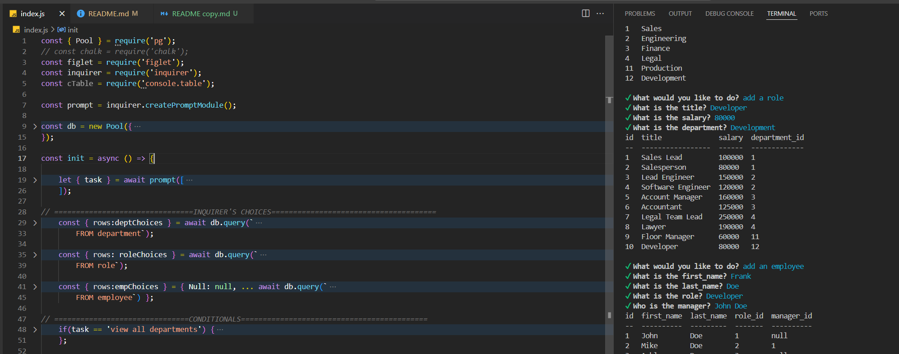

# SQL-EMPLOYEE-MGMT

## Website: 
[website](https://github.com/NoelNS/SQL-Employee-MGMT)

## Description
The project is a backend applications that manages employees in a SQL database.

## Table of Contents
- [Installation](#installation)
- [Usage](#usage)
- [Credits](#credits)
- [License](#license)
- [Features](#features)
- [Tests](#tests)
- [Contact](#contact)
- [Walkthrough](#walkthrough)

## Installation
pg, console.table, figlet and inquirer

## Usage
Run "node index.js" on the terminal

## Credits
Noel Sanchez

## License
MIT

## Features
It manages a SQL database

## Tests
confirm result of query on the terminal

## Walkthrough
[Walkthrough Video](https://app.screencastify.com/v2/watch/GCsjihxX41tTb0yEV4ds)

## Contact
If there are any questions or concerns, I can be reached at:
##### [github: NoelNS](https://github.com/NoelNS)
##### [email: ns.sanchez724@gmail.com](mailto:ns.sanchez724@gmail.com)
